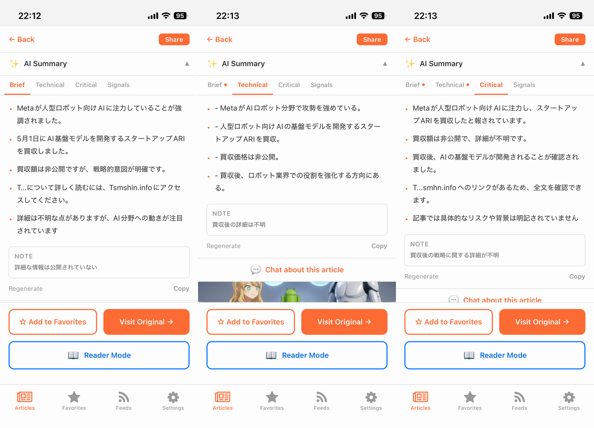

# I Put a Local LLM in My RSS Reader Because I Don't Trust the Cloud With My Reading List

*Adding on-device AI to FeedOwn — summaries, signals, chat, and translation, none of which leave your phone*

---

## A short recap

If you missed the previous installments: I built [FeedOwn](https://feedown.pages.dev), a self-hosted RSS reader, because I'm afraid Feedly will eventually shut down the same way Pocket and Google Reader did. The first article was [the "why"](https://medium.com/p/c7fc8c738e90). The second was [the "how it costs $0/month"](https://medium.com/p/2dbaa869fe54).

This one is about what I added next: **AI features that run entirely on your phone.** No API keys, no OpenAI account, no "your data may be used to improve our models" clause. Just a small language model running on the silicon you already own.

*The On-Device AI settings screen. You pick a model, you tap Download, and that's it.*

---

## Why I avoided the obvious answer

When I started thinking about adding AI to FeedOwn, the obvious move was to wire up the OpenAI or Anthropic API. Slap a "Summarize" button on each article, send the text to a cloud endpoint, get back JSON. A weekend of work, tops.

I thought about it for a couple of days and then I didn't do it.

The whole point of FeedOwn is that **my reading habits don't belong to anyone but me**. I built it specifically because I don't want a third party to know which tech blogs I obsess over, which political opinions I sample, which side projects I research at 2 AM. Pasting all of that into a hosted LLM API is the opposite of what I'm trying to do here.

There's also a more boring reason: API calls cost money. FeedOwn runs on $0/month. Bolting on a per-token meter would have killed that.

So I went the other way and put the model on the device.

---

## What "on-device" actually means here

I used [`react-native-executorch`](https://github.com/software-mansion/react-native-executorch), a React Native binding for [Meta's ExecuTorch](https://pytorch.org/executorch/) runtime. ExecuTorch is the same on-device inference engine Meta uses to run models locally on phones. The library exposes a small set of pre-quantized open-source LLMs you can drop into a React Native app: variants of LFM 2.5 (350M and 1.2B) and Qwen 3 (0.6B and 1.7B).

Practically, this means:

- The first time you turn AI on, the app downloads a model (roughly 0.5–1.5 GB depending on which one you pick). Once.
- After that, **every summary, every chat reply, every translated paragraph runs locally**. Airplane mode works fine.
- The article body is never serialized into an HTTPS request to a server I don't own.
- There is no per-token bill at the end of the month.

The cost is real, just paid in different currency: storage, RAM, and a few seconds of generation latency. iOS 17+ and Android 13+ are required because of New Architecture and ExecuTorch's runtime requirements. It's not free — but the price is paid in resources you already have, not in privacy you can never get back.

---

## The features I added

I framed this as a Phase 0–9 plan in the repo and shipped four user-visible features. (TTS read-aloud is implemented but currently commented out — small models couldn't pull it off well enough to justify the model download.)

### 1. Summaries — but with three perspectives, not one

This is where I tried to add something that hosted "summarize this article" buttons usually don't. The same article gets summarized from three different angles, on demand:

- **Brief**: a neutral 3–5 bullet summary.
- **Technical**: focuses on technologies mentioned, implementation details, trade-offs, dependencies.
- **Critical**: extracts claims that lack evidence, missing context, weak reasoning, things the author might be glossing over.

The idea is that "summary" isn't a single thing. When I'm catching up on news, I want the brief. When I'm reading a release announcement, I want the technical view. When I'm reading marketing-flavored tech blogging, I want the critical pass to flag the parts I should be skeptical about.

*A summary being generated. The progress bar reflects token streaming from the local model.*

The output is bullet points plus optional caveats — places where the model itself flagged uncertainty. Both the Japanese and English flows look the same:

*Brief summary of a Japanese article.*

*Same flow on an English article.*

Results are cached per `(article × content hash × model × perspective × output language)`. If you re-open an article you summarized yesterday, the result comes back instantly with no regeneration. If the article body changes (Reader Mode pulls in fresh content), the hash changes and you get a new summary.

### 2. Signals — "what kind of statement is this?"

This one I'm the most attached to. Instead of a summary, it asks the model to **classify the article's content by signal type**:

- `fact` — confirmed dates, numbers, releases, specifications
- `claim` — author's interpretations or opinions presented as conclusions
- `speculation` — predictions, "might", "could", "we expect"
- `quote` — direct quotes attributed to a person or source
- `promotion` — sign-up prompts, calls to action, sponsor language
- `unclear` — statements with weak evidence or missing sources

Each item gets a confidence rating (high/medium/low). The model is told to skip categories that aren't present and to mark the article as `insufficient` if it's too short to classify.

*The Signals tab. Each item is tagged with its type and a confidence rating.*

This doesn't try to fact-check anything. The local model isn't a knowledge base. What it does is help you **see at a glance** that what looks like a news article is mostly `claim` and `promotion`, or that the technical announcement is 80% `speculation`. That's surprisingly useful for an RSS reader full of mixed-quality sources.

### 3. Chat — grounded in the article you're reading

A chat screen scoped to one article. The system prompt is locked: "Answer only using information from this article. If the article doesn't say, say so."

*Chat about the article you just read. The conversation lives only on your device.*

I built it on top of `react-native-gifted-chat` and Stack navigation (not a modal — keyboard handling is much better that way; I learned this the hard way). The article context is injected once into the system message, then chat history is appended turn by turn. The whole conversation lives in component state and is discarded when you leave the screen — there's no chat history sync, no analytics, no nothing.

It's not ChatGPT. The 1.2B model isn't going to write your essay for you. But for "wait, what did the article say about X?" or "summarize the part about the migration path" — it's surprisingly good.

### 4. Translation — for foreign-language articles

If the article's source language differs from your output language preference, a Translate button shows up in Reader Mode. The model translates paragraph-by-paragraph, into a JSON array, with a one-shot repair retry if it hands back malformed JSON.

*Translation toggle in Reader Mode. Tap to switch between Original and Translated.*

This was the feature I was most skeptical about going in — small quantized models translating into Japanese sounded ambitious. It's not perfect, but it's good enough for "what is this English blog post actually saying" without sending the article off to Google Translate.

A small detail I'm proud of: I cap the translation input at 2,500 characters to stay safely inside the model's context window. If I just shoveled the whole article in, the model would silently fail with a vague "Failed to generate text" error. Trimming the input up front and adding `.catch()` on the generate call made it actually reliable.

---

## What it looks like in practice

You go into Settings → On-Device AI, flip the toggle, pick a model, and tap Download. The download takes a few minutes — these are real LLMs, not toy models. Once the model is ready, every article gets an AI panel.

The first time you tap Summarize on an article, expect a 5–20 second wait depending on the model and your phone. After that, the result is cached and instant. The phone gets warm. The battery indicator moves a little. That's the price.

For me, the price is worth it because of what doesn't happen: there is no log file on someone else's server with a record of which article I summarized at what time.

---

## A few honest caveats

I'm not pretending the small on-device models are competitive with GPT-4 or Claude. They're not. What they are is **good enough for short, focused, article-shaped tasks**, which is exactly the shape of the work in an RSS reader.

Things I learned the hard way:

- **JSON output from small models is fragile.** I had to write a parser that strips Markdown code fences, finds the first `{` and the last `}`, validates shape, and on failure sends back a one-shot repair prompt. About 95% land on the first try with that pipeline; the repair catches most of the rest.
- **Context windows matter more than people admit.** Translation of a long article failed silently until I capped paragraphs at 2,500 chars total. Summary works because the article context builder caps at 4,000 chars. Without these caps, the model just throws a generic "Failed to generate text" error with no useful information.
- **Real devices only.** ExecuTorch doesn't run in the iOS Simulator or Android Emulator. Phase 0 of this project was just verifying the model could load on a physical device before I wrote any feature code.
- **Pick the right model.** The 1.2B LFM 2.5 is the default because it's the best quality/speed/RAM trade-off. The 350M variant exists for low-RAM devices but the summary quality drops sharply. The 1.7B Qwen 3 is better but heavy.

---

## Why this matters

The current direction of consumer AI is one giant API call away from your data. Every "AI-powered" feature in every app is, in practice, a pipe to someone else's server. The terms of service usually say the right things, but the data is going through their infrastructure either way.

Putting the model on the device flips that. It costs more in storage and inference time, but the privacy story is whole again. **The article body, the summary, the chat conversation — none of it leaves the phone.** That's not a marketing claim, that's a structural property of the architecture.

I don't think every app should run its own LLM. But for something as personal as a reading list, where the entire value of the app is "this is your media diet, no one else's" — running the AI locally is the only configuration that's coherent with the rest of the product.

---

## Try it

The mobile app has the AI features. The web app doesn't (and probably won't — the model sizes are too large for browsers, and the privacy story doesn't transfer once you're sending the article to a server-side model).

- iOS: [App Store](https://apps.apple.com/us/app/feedown/id6757896656)
- Android: [Google Play](https://play.google.com/store/apps/details?id=net.votepurchase.feedown)
- Source: [GitHub](https://github.com/kiyohken2000/feedown)
- Web: [feedown.pages.dev](https://feedown.pages.dev)

Settings → On-Device AI to enable it. Be aware: the first model download is ~1 GB, so use Wi-Fi.

---

## Previous articles in this series

- [I Built My Own RSS Reader Because I'm Afraid Feedly Will Die Someday](https://medium.com/p/c7fc8c738e90)
- [Building a $0/Month RSS Reader with Cloudflare and Supabase](https://medium.com/p/2dbaa869fe54)

---

*If you're working on on-device AI, or thinking about it, I'd love to hear from you. The library ecosystem is still early but the trajectory feels right — small, capable models running locally beats large, capable models running on someone else's hardware for a lot of personal-data use cases.*
