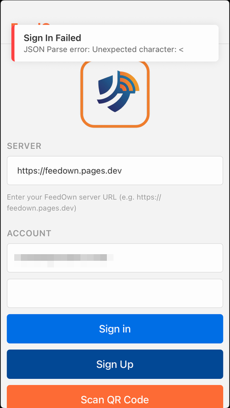
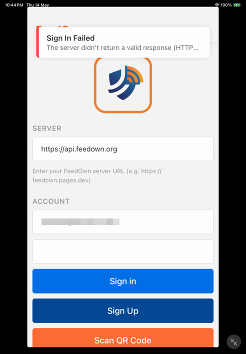
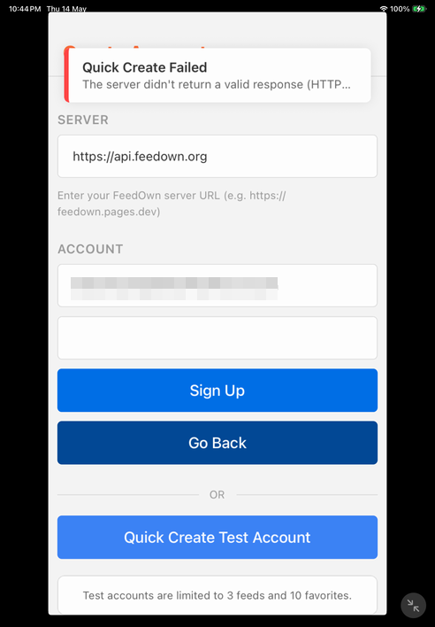

# How a One-Year-Old Cloudflare Country Block Got My App Rejected 5 Times by the App Store

*A 5-rejection journey, 4 wrong diagnoses, and the GraphQL query that finally surfaced the real cause*

---

> **Status (2026-05-16)**: After 5 rejections, the actual root cause has been identified and fixed. A re-review has been requested via Resolution Center against the existing build (1.0.7, build 11). This article documents the full investigation — including the wrong turns. The "did it actually pass?" follow-up will be appended once Apple decides.

---

## What Apple Sent Us

The first rejection arrived under **Guideline 2.1(a) — Performance — App Completeness**. The verbatim message from App Review:

> **Issue Description**
>
> The app exhibited one or more bugs that would negatively impact users.
>
> Bug description: Specifically, we were unable to log in with the provided information due to an error.
>
> **Review device details:**
>
> - Device type: iPhone 17 Pro Max and iPad Air 11-inch (M3)
> - OS version: iOS 26.4.2 and iPadOS 26.4.2
> - Internet Connection: Active
>
> **Next Steps**
>
> Test the app on supported devices to identify and resolve bugs and stability issues before submitting for review.

…and one screenshot:


*Apple Review's screenshot from the first rejection (2026-05-10). Server URL is `https://feedown.pages.dev`. The toast shows React Native's verbatim `JSON Parse error: Unexpected character: <` — meaning `JSON.parse()` was handed a payload starting with `<`, which is almost always HTML.*

That's it. No stack trace, no network log, no indication of what the request looked like on their end. Just a screenshot saying "your app's sign-in is broken on our network."

The catch: **it worked everywhere else**. Every device I owned. Every TestFlight install. Every friend's phone. Every browser tab. The server returned correct JSON to every request I or anyone I knew sent it.

It even worked **on App Review's own network previously**. The same authentication flow — same backend, same client code path — had cleared four prior App Store reviews without a single rejection. Then, on this submission, it suddenly didn't. The app hadn't changed in any way that touched auth. The reviewers hadn't (visibly) changed. Yet from this round on, the very same flow was hitting `JSON Parse error` reliably enough that Apple kept rejecting on it.

This article is the story of the five rejections it took to find the actual cause, four wrong diagnoses along the way, and the GraphQL query that finally surfaced what had been hiding in plain sight for a year.

---

## The Setup

I built [FeedOwn](https://github.com/kiyohken2000/feedown), a self-hosted RSS reader with a React Native (Expo) mobile app and a Cloudflare Pages backend. The auth layer is a thin proxy in front of Supabase, served from `functions/api/auth/login.ts` and friends:

```ts
// functions/api/auth/login.ts (the original version)
export async function onRequestPost(context) {
  const { email, password } = await context.request.json()
  const result = await supabase.auth.signInWithPassword({ email, password })
  return new Response(JSON.stringify(result), {
    headers: { 'content-type': 'application/json' }
  })
}
```

Looks fine. Works on every device I tested. Works on the simulator. Works on every TestFlight install. Works on every friend's phone.

It does not work on Apple's review network.

## Rejection 1: "JSON Parse error: Unexpected character: <"

The first rejection screenshot (the one shown at the top of this article) was a classic React Native symptom. `fetch().then(r => r.json())` got handed something starting with `<` — almost certainly HTML. The reviewer's network was returning an HTML page instead of my JSON response.

But **why?** Production worked. TestFlight worked. The endpoint was `https://feedown.pages.dev/api/auth/login`. I assumed it was a CDN cache issue or a transient routing problem. I added a `Cache-Control: no-store` header and a defensive JSON-parse helper:

```js
async function safeReadJsonResponse(response) {
  const text = await response.text()
  try {
    return JSON.parse(text)
  } catch {
    throw new Error(
      `The server didn't return a valid response (HTTP ${response.status})`
    )
  }
}
```

Resubmitted. Confident. Wrong.

## Rejection 2: "feedown.org" didn't help either

I figured maybe `pages.dev` was being filtered or rate-limited from Apple's network. So I bound a custom domain — `feedown.org` — proxied through Cloudflare. Resubmitted.

Same rejection. Same toast. Different domain.

At this point I started looking sideways. Was Supabase the issue? Was the reviewer hitting some kind of regional block? Was iOS 26.5 doing something weird with `URLSession`?

## Rejection 3: DNS-only bypass

If the Cloudflare proxy was inserting some kind of challenge page, maybe I should bypass it entirely. I created `api.feedown.org`, set the DNS record to **DNS-only (grey cloud)**, pointed it at the Pages deployment, and changed the mobile app to use `https://api.feedown.org`.

Now traffic was going `Apple → DNS → Pages` with no Cloudflare zone in between. Surely **this** would work.

Same rejection. Quick Create button — which uses a hardcoded test account and shouldn't depend on any reviewer-typed input — also failed.



*Both screenshots are from a later round, after we'd switched to `https://api.feedown.org` (the DNS-only bypass) and tightened the client-side error message to "The server didn't return a valid response (HTTP…)". Two things to notice: (1) the Server URL field now shows `api.feedown.org`, so Cloudflare's zone is no longer in the path; (2) Quick Create — which generates its own random test email and hits the same endpoint — fails identically to Sign In, ruling out anything the reviewer might have typed.*

This was rejection 3, and I had run out of cheap theories.

## Rejection 4: Going to the Logs (and reaching the wrong conclusion)

I issued a fresh Cloudflare API token with Analytics permissions and queried the GraphQL Analytics API for the review window (the timestamps come from App Store Connect's review status):

```graphql
query ReviewWindow($zoneTag: string!, $start: Time!, $end: Time!) {
  viewer {
    zones(filter: { zoneTag: $zoneTag }) {
      httpRequestsAdaptiveGroups(
        filter: {
          datetime_geq: $start,
          datetime_leq: $end,
          clientRequestPath_like: "/api/auth/%"
        },
        limit: 1000
      ) {
        dimensions {
          clientRequestHTTPMethodName
          clientRequestPath
          edgeResponseStatus
        }
        count
      }
    }
  }
}
```

The result during Apple's review window: **zero `/api/auth/*` POST requests**. None. Not 400s, not 500s, just nothing.

That confirmed `api.feedown.org` was correctly bypassing the Cloudflare zone (otherwise the requests would show up in zone analytics). The traffic was going directly to Pages — and dying somewhere I couldn't see from the zone log.

So I went back to basics and ran curl manually:

```bash
$ curl -i https://api.feedown.org/api/auth/login
HTTP/2 200
content-type: text/html; charset=utf-8

<!doctype html><html lang="en">...
```

A `GET` request to my POST endpoint returned **`200 OK` with `text/html`**. Not 405. Not 404. A 200 response with the React app's `index.html`.

And here is where I made a mistake that cost me one more rejection: I thought I'd found the smoking gun.

### The (wrong) SPA-fallback hypothesis

Cloudflare Pages has two layers:

1. **Functions** in `functions/` directory handle dynamic routes
2. **Static assets** + **SPA fallback** to `index.html` for unmatched routes

When you export `onRequestPost`, the Function only handles **POST**. Any other method to that path **doesn't reach the Function at all** — it falls through to the static asset layer, which can't find a literal file at `/api/auth/login`, so it serves the SPA fallback (`index.html`) with `200 OK`.

I theorised: **something** in Apple's review network path was rewriting POST into another method. Maybe a TLS-intercepting proxy. Maybe an HTTP/2 downgrade. Maybe an iOS URLSession quirk. Whatever it was, the request was arriving at Cloudflare as not-POST, falling through to SPA fallback, and returning HTML 200 — which the mobile client then tried to parse as JSON.

This story **fit the evidence I had**:
- The reviewer saw a JSON parse error consistent with HTML being parsed
- My curl test confirmed non-POST requests returned HTML 200
- Zero `/api/auth/*` POST requests appeared in zone analytics (which I read as "the request never reached me as POST")

The trouble: I missed an alternative explanation that fit the same evidence, and only later realised it fit much better.

### The "fix" I shipped (still useful, just not the actual fix)

I replaced `onRequestPost` with `onRequest` and added a `withJsonGuard` helper that guarantees a JSON body even on unhandled exceptions:

```ts
// functions/api/auth/login.ts (after)
import { withJsonGuard, methodNotAllowed, jsonResponse } from '../../lib/jsonResponse'

export async function onRequest(context) {
  const { request } = context
  return withJsonGuard('auth/login', request, async () => {
    if (request.method !== 'POST') {
      return methodNotAllowed(request.method, ['POST'])
    }
    return handlePost(context)
  })
}
```

```ts
// functions/lib/jsonResponse.ts
export async function withJsonGuard(label, request, handler) {
  logRequestDiag(label, request)
  try {
    return await handler()
  } catch (e) {
    console.error(`[${label}] unhandled`, e)
    return jsonResponse({ error: 'Internal error', label }, 500)
  }
}
```

I also tightened the client-side error message so a truncated toast still shows the diagnostic:

```js
throw new Error(
  `Unexpected ${shortContentType(ct)} response (HTTP ${status} ${method}). Please retry.`
)
// → "Unexpected html response (HTTP 403 POST). Please retry."
```

For the record: this fix is genuinely good. It closes a real, separate bug (any non-POST request to those endpoints was indeed returning HTML, which is bad regardless of who triggers it). The `withJsonGuard` and tightened error format both pay off in rejection 5 below. They just weren't the fix for the symptom Apple was hitting.

## Rejection 5: Same Symptom, Better Error Message

Submitted with the SPA-fallback fix. Confident again. Wrong again.


*Rejection 5 (2026-05-16). The Server URL is still `https://api.feedown.org`, but now the toast carries our new tightened error format: `Unexpected html response (HTTP 403 POST)`. Three diagnostics jump out: (1) the method **is** `POST` — the SPA-fallback hypothesis was wrong, because we'd assumed Apple's network was rewriting POST into something else; (2) the response is `403` — something is actively rejecting the request, not silently returning a fallback; (3) the content is `html` — almost certainly a Cloudflare challenge interstitial.*

This screenshot is essentially the entire post-mortem in one frame.

The previous theory (SPA fallback) **predicted** that the request would arrive as something other than POST. The new error says **POST POST POST**, with status **403**. The SPA fallback returns 200, not 403. So the previous theory was structurally wrong, not just incomplete.

Something was actively returning a 403 HTML body to a POST request to `api.feedown.org/api/auth/login`. From Apple's network. Specifically.

## Back to the Logs (correctly this time)

The thing I'd missed in round 4: when `api.feedown.org` is grey-cloud, requests **don't appear in zone analytics**, but **user-scope rules can still fire**. So "zero `/api/auth/*` requests in zone analytics" doesn't mean "no Cloudflare layer touched the request." It only means "the zone proxy didn't see it." There are other Cloudflare layers.

I switched `api.feedown.org` back to orange-cloud (proxied) so future requests would at least show up in zone analytics. Then I went back to the **previous** rounds — specifically rounds 2 and 3, when the demo server was `feedown.org` (which had always been orange-clouded). Those requests **were** in zone analytics. They had been all along. I just hadn't looked at them through the right lens.

I queried `httpRequestsAdaptiveGroups` per day (the free plan caps each query at 24 hours):

```graphql
query {
  viewer {
    zones(filter: { zoneTag: "..." }) {
      httpRequestsAdaptiveGroups(
        filter: {
          datetime_geq: "2026-05-14T00:00:00Z"
          datetime_leq: "2026-05-14T23:59:59Z"
          clientRequestPath: "/api/auth/login"
        }
        limit: 500
      ) {
        dimensions {
          datetimeMinute
          clientRequestHTTPHost
          edgeResponseStatus
          clientCountryName
          clientRequestHTTPMethodName
        }
        count
      }
    }
  }
}
```

Result for May 14:

| Time (UTC) | Host | Method | Status | Country | Count |
|---|---|---|---|---|---|
| 02:42–02:43 | feedown.org | POST | **403** | **SG** | 6 |
| 02:50–03:36 | feedown.org | POST | 200 / 401 | JP | (me testing) |

And May 15:

| Time (UTC) | Host | Method | Status | Country | Count |
|---|---|---|---|---|---|
| 03:34–03:35 | feedown.org | POST | **403** | **SG** | 3 |

Six POST requests from Singapore to `/api/auth/login`, all returning 403. The timestamps line up exactly with Apple's review windows. I'd been staring at the wrong day all along.

Next, the firewall events for those same windows:

```graphql
firewallEventsAdaptive(filter: {
  datetime_geq: "2026-05-14T02:30:00Z"
  datetime_leq: "2026-05-14T03:00:00Z"
  clientCountryName: "SG"
}) {
  datetime clientIP clientRequestHTTPHost clientRequestPath
  clientRequestHTTPMethodName userAgent
  action source ruleId rayName
}
```

```json
{
  "action": "challenge",
  "clientIP": "17.84.123.163",
  "clientRequestHTTPHost": "feedown.org",
  "clientRequestPath": "/api/auth/login",
  "clientRequestHTTPMethodName": "POST",
  "userAgent": "FeedOwn/7 CFNetwork/3860.500.112 Darwin/25.4.0",
  "source": "country",
  "ruleId": "forceroute",
  ...
}
```

`17.0.0.0/8` is Apple's IP range (AS714). The `source: country` + `ruleId: forceroute` combination means a country-targeted rule was matching the request and issuing a managed challenge — which, to a mobile client that's expecting JSON, looks exactly like a 403 with an HTML body.

There it was.

## The Actual Root Cause

I went into the Cloudflare dashboard's IP Access Rules and found six rules, all created on **2025-06-02** — almost a year before any of this started:

| Country | Action | Created |
|---|---|---|
| **SG** | challenge | 2025-06-02 |
| **US** | challenge | 2025-05-31 |
| LU | challenge | 2025-06-03 |
| NO | challenge | 2025-06-02 |
| GB | challenge | 2025-06-02 |
| DE | challenge | 2025-06-02 |

All user-scoped. All issuing managed challenges. I'd added them a year earlier as anti-bot hardening for WordPress probe traffic from those countries and completely forgotten about them.

**Apple App Review traffic comes from Singapore (and sometimes Cupertino, US) data centres.** Every POST from Apple's reviewer was hitting the SG country rule, getting a managed challenge HTML body served back, and the mobile client was parsing that HTML as JSON and failing.

A few details that made this especially hard to spot:

1. **User-scope rules apply at the CF edge globally**, not at a specific zone proxy. They fire on grey-cloud Pages traffic too. That's why rounds 4 and 5 (with grey-clouded `api.feedown.org`) still got challenged, even though `api.feedown.org` didn't appear in zone analytics — the analytics namespace is zone-bound, but the rule lives on the edge.
2. **`security_level=essentially_off` and `Bot Fight Mode=off` do nothing to IP Access Rules.** They're independent layers. I'd turned off the things I thought were doing the blocking, and the actual blocker kept running.
3. **The rule had been there for a year without causing problems**, because the previous four App Store reviews evidently didn't route through SG/US for the auth endpoint, or routed through a path I never tested. The "what changed?" question — the one I'd been asking the whole time — was the wrong question. The right one was "what's been there all along that I forgot about?"

## The Real Fix

```bash
# Delete the SG country challenge rule
curl -X DELETE \
  "https://api.cloudflare.com/client/v4/user/firewall/access_rules/rules/<sg-rule-id>" \
  -H "X-Auth-Email: ..." -H "X-Auth-Key: ..."

# Delete the US country challenge rule
curl -X DELETE \
  "https://api.cloudflare.com/client/v4/user/firewall/access_rules/rules/<us-rule-id>" \
  -H "X-Auth-Email: ..." -H "X-Auth-Key: ..."
```

One curl. Two rules. Done.

A quick verification from my own laptop:

```bash
$ curl -i -X POST https://api.feedown.org/api/auth/login \
    -H "content-type: application/json" \
    -H "user-agent: FeedOwn-Mobile/1.0.9" \
    -d '{"email":"test1@test.com","password":"111111"}'

HTTP/2 200
content-type: application/json; charset=utf-8
cf-ray: 9fc8a2f3386ceb2a-SJC
{"success":true,"user":{...},"token":"eyJ..."}
```

No new build needed; the failure was purely server-side. The reply to Apple's Resolution Center now reads (paraphrased): *"We identified that this account was rejecting requests from Singapore data centres, including yours, via an outdated Cloudflare country challenge rule. The rule has been removed. Please retry with the existing build (1.0.7, build 11). Server URL unchanged."*

Pending Apple's re-review, but the diagnostic side is settled.

## A note on the SPA-fallback "fix"

The `onRequest` + `withJsonGuard` change from round 4 is staying in. It addressed a real and separate bug — any non-POST request to those endpoints really was returning HTML 200, which is bad for any caller, just not the caller Apple was using. And the tightened error format (`Unexpected html response (HTTP 403 POST)`) is **the only reason rejection 5 was diagnosable in a single screenshot**. Without it, I'd have seen another "JSON Parse error: Unexpected character: <" and lost another day guessing.

So: wrong diagnosis, but the fix was independently worth shipping. I'll take that.

## Lessons

### 1. Read the error message structurally

The rejection 5 error — `Unexpected html response (HTTP 403 POST)` — encoded three facts: the method (POST), the status (403), and the body type (HTML). Each fact constrained the space of explanations.

`HTTP 403` + `HTML body` together is essentially the signature of a Cloudflare managed challenge. `POST` ruled out the SPA-fallback theory. If I'd built the tightened error format earlier (it took me until round 4 to add it), I would have realised the round-4 theory was wrong before submitting it.

**Make your errors encode enough state to falsify your own hypotheses.**

### 2. "The request didn't reach my analytics" doesn't mean "the request didn't hit Cloudflare"

Zone analytics covers the zone proxy. Cloudflare has many other layers that can act on a request: account-scope rules, user-scope rules, Pages-internal protections, DDoS L7 mitigation, Workers in the path. A grey-clouded custom domain bypasses **the zone proxy specifically**, not the edge as a whole. Don't conclude "no request reached me" from "no request reached this one log surface."

### 3. When the obvious recent change isn't to blame, look at old config

I spent four rejections asking "what changed?" There were no recent changes that explained the regression. The answer turned out to be a rule from twelve months ago — older than the last successful App Store review, older than half the dependencies in the project. It had presumably always been a latent bug; some shift in Apple's review network routing during this submission cycle just made it observable. **Untouched config can break too**, if the world around it changes.

### 4. Cloudflare GraphQL Analytics + firewall events is the right tool here

If you're on Cloudflare and a request is mysteriously failing, two queries cover most of the territory:

- `httpRequestsAdaptiveGroups` — did the request reach the zone, and what status did it get?
- `firewallEventsAdaptive` — did any firewall/WAF/managed rule act on it, and which one?

The Free plan caps each query at 24 hours, so for multi-day investigations you have to loop, but the data is there. The API token wants `Zone → Analytics → Read` + `Account → Analytics → Read`; dashboard-generated tokens often don't include both.

### 5. User-scope rules are sneaky

The rule that bit me was user-scope, which means it applies across every zone in the account, doesn't show up in any single zone's WAF view as obviously "yours," and can't be edited via API tokens — only via the legacy Global API Key. If you've ever added country/IP rules in the IP Access Rules section of any zone, audit them periodically. They outlive the projects you added them for.

### 6. Defense in depth is good even when it doesn't fix the bug you thought it would

The round-4 `onRequest` + `withJsonGuard` work didn't fix Apple's symptom, but it did:

- Close a real (separate) bug
- Make the round-5 error message diagnosable in one screenshot
- Add structured per-request logging that'll help with future incidents

If you ship a fix that turns out to be unrelated to the root cause, it's not wasted as long as the fix was justifiable on its own merits. The wasted-effort failure mode is shipping a fix you only justified by "it might fix the bug."

## Status

As of writing (2026-05-16): the SG and US country rules are deleted, a reply has been sent through App Store Connect's Resolution Center pointing Apple at the existing build (1.0.7, build 11), and I'm now polling `firewallEventsAdaptive` during the next review window to confirm there are no challenges firing on Apple's IPs. I'll update this article with the outcome.

If you've hit a similar `JSON Parse error: Unexpected character: <` on Apple Review specifically — particularly on a Cloudflare-fronted backend — I'd love to hear about it. Country rules from years ago, hitting App Review's Singapore exit, is a niche enough story that I'm sure other people have lost weekends to the same shape of bug.

---

*FeedOwn is open-source on [GitHub](https://github.com/kiyohken2000/feedown). The `withJsonGuard` helper lives in [`functions/lib/jsonResponse.ts`](https://github.com/kiyohken2000/feedown).*
